# cybered20
This repository was created to teach you the basics of creating and managing a github repository. Use this to kickstart your knowledge about git and related commands. You can also copy commands from here if you don't like scraping google for answers. :) 

## Step 1 - Create your repository
After creating an account on a github, you'll be presented with a window similar to this one.

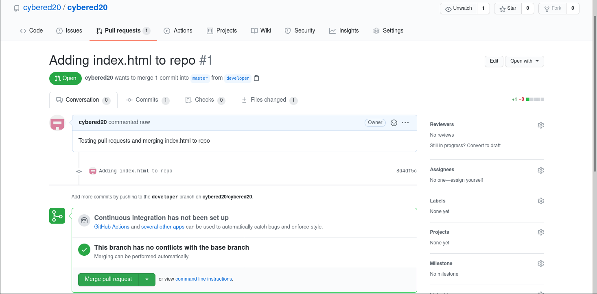

Clicking on your profile in the top right corner will let you navigate to your repositories.

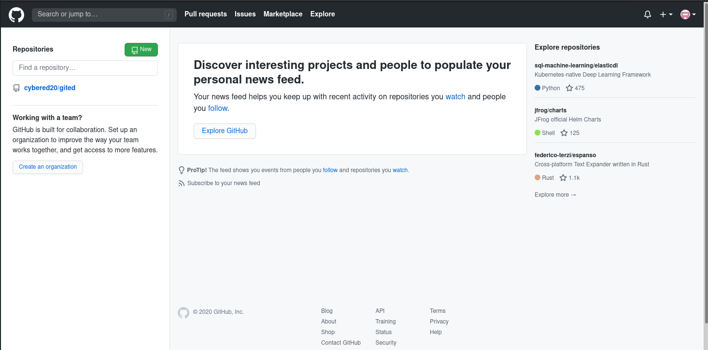

Once you're here, clicking the `New` button will let you create a new repository. Simply fill out the form as you wish and click the `Create repository` button.

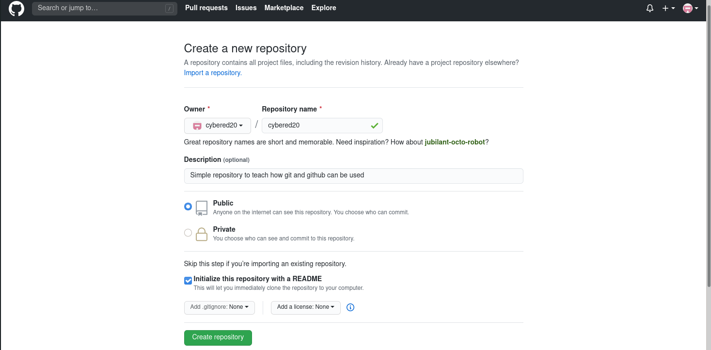

You'll be taken right to your new repository. It should look something like this.

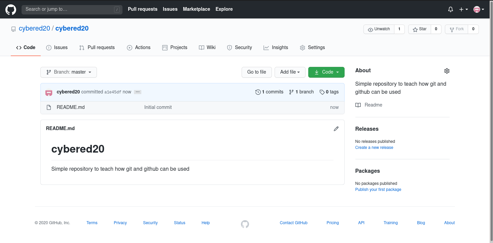

## Step 2 - Clone your repo

This repository however only exists on github for now, to work on it locally on your computer, you'll need to clone it. Click the `Code` button and copy the link from the dropdown menu.

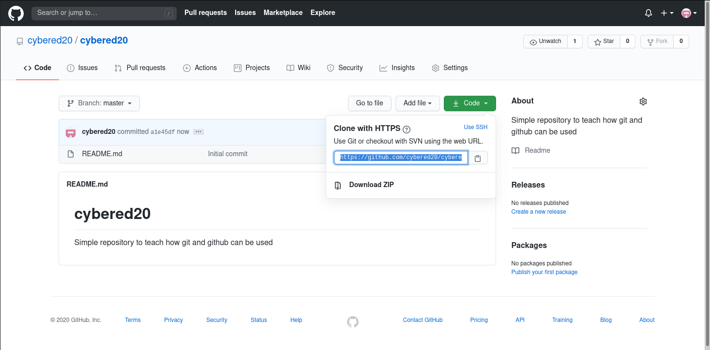

Now you can clone the repository, simply navigate to the folder in which you'd like to copy the repo to and issue the `git clone <URL>` command. If everything went right, you should now see the files on your computer.

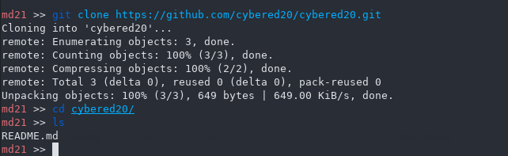

Make changes to this local repository by creating and editing files on your computer.

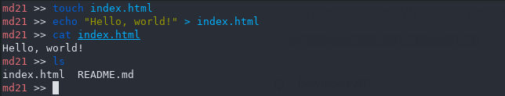

## Step 3 - Commiting and pushing your changes

You can add these files to your local repo with the `git add` command, and make a commit using `git commit -m '<message>'`. By commiting the changes, your local repo now contains work not found on github. This is a good time to do a `push` by pushing your local changes. You can push the changes to your repo with the `git push` command. **IMPORTANT** check out the next step for safety reasons! 

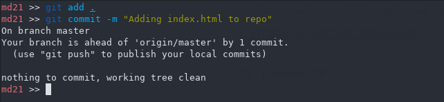

## Step 4 - Branching

**IMPORTANT** You might want to make a different branch. If you push your changes now, others might clone it, even if you messed something up. Cloning a repo which contains code that doesn't even work is a turndown. Use the `git checkout -b developer` command to create a local branch called `developer` (by using the `-b` flag the branch will be created even if it doesn't exist yet). 

By pushing your changes to this branch, you make sure that faulty code doesn't directly make its way into a branch that might be cloned by others.

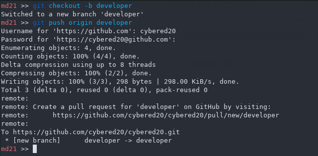

You can think of branches as different folders containing your code. There's one that can be seen by others, it's working fine as it is. And there's one you're working on. It might contain features which are broken at the moment, you haven't had time to work on them for days but if someone want's to use your code, he can use a version that's working correctly.

Check out your repository on github. If you click on the `Branches` tab, you'll be able to choose the `developer` branch from the dropdown menu. The changes can be found on this branch.

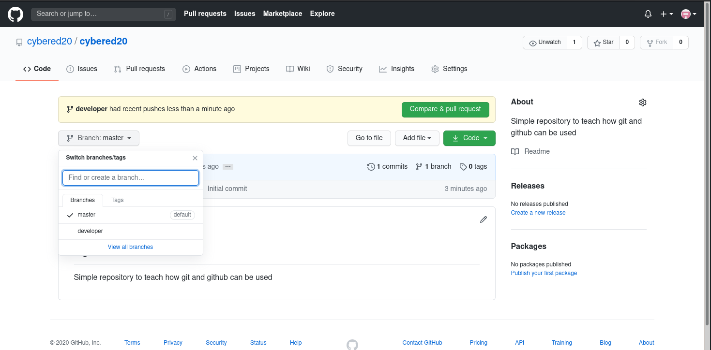

## Step 5 - Making a pull request

As you can see, the new file is present in the `developer` branch but not in the `master`. If you want to add your feature to the master branch, simply click on the `Compare & pull request` button. 

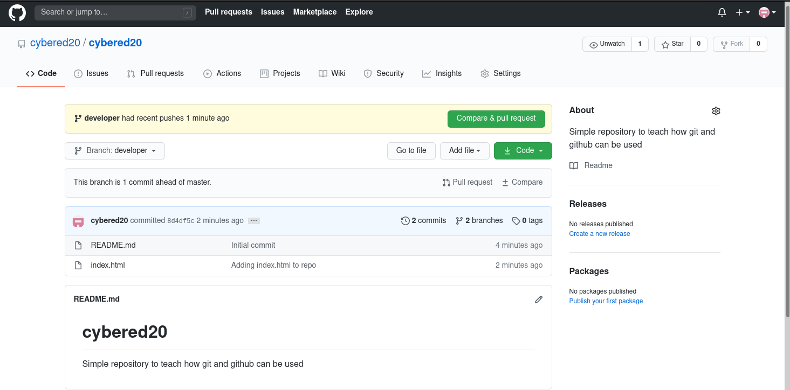

Leaving a comment is sort of like creating a post, leave a note about what you added / changed and you're done. You can merge your own commit using the `Merge pull request` button, or wait for the maintainer to do it. Be ready for making changes in your pull request, the maintainer might want your work to comply to different standards.

When you or the maintainer merged your request, the request will be closed and the changes will be present in the master branchs as well.

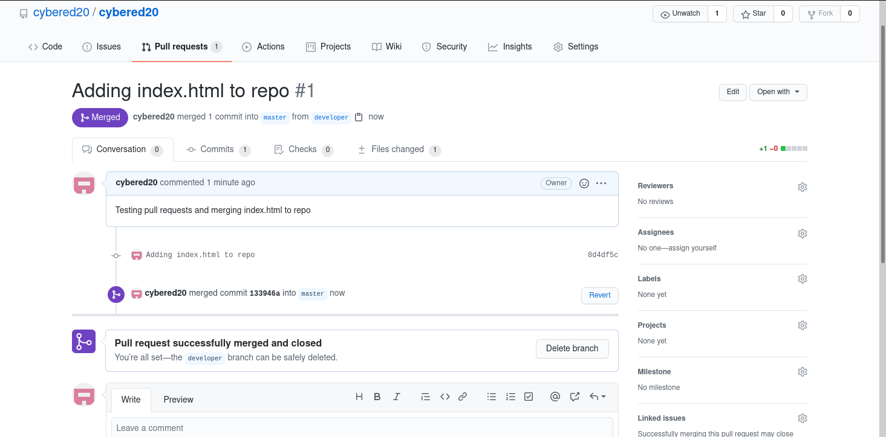

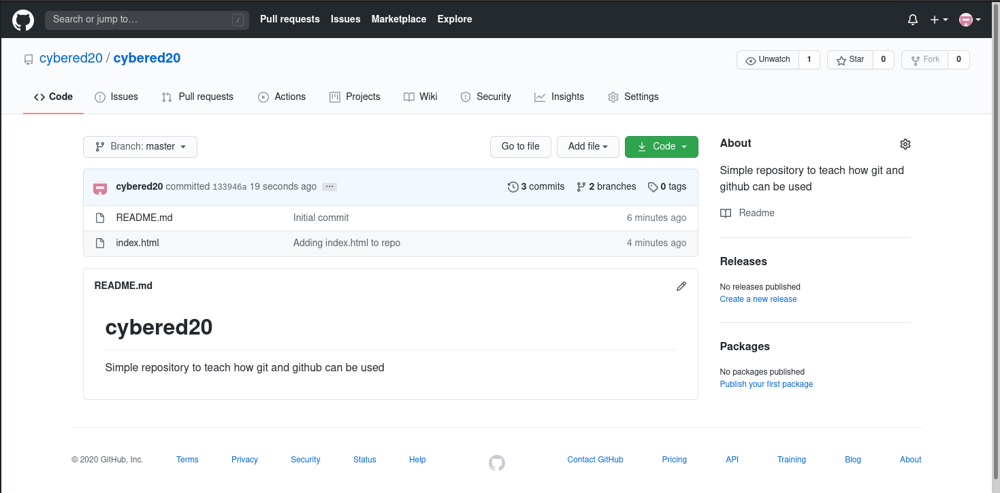

# Step 6 - Pulling your repo

The last step is to sync your local repo with the one on github. If you haven't touched a project for some time, or others are working on it and some pull requests have been merged into the master branch, your local repo is now left behind. 

There are changes that should be present in your local repo as well. To merge the github repo into your local one you can simple issue the `git pull <branchname>` command and have the changes merged into your local repo.
It might be a good idea to make a `pull` on your local master branch. 

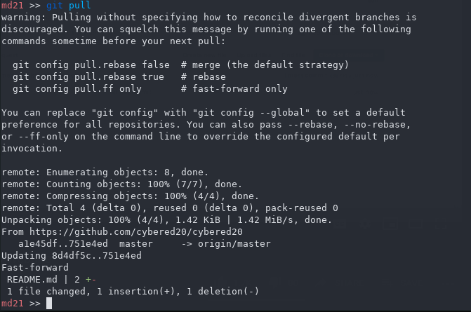

This way you can always have the latest working version of the code in your local repo, and work on a developer branch derived from that latest version. 
